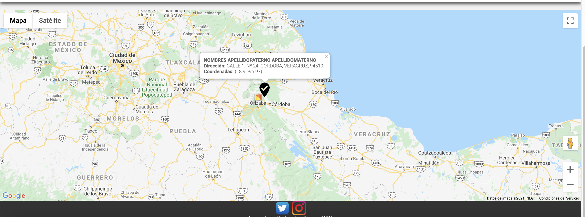

# -CursoJS-PracticaFinal-RegistroClientes

# Curso de Introducción a HTML, CSS y JavaScript

## Practica Final - **Registro Cliente** :robot:

## 1) Crea la práctica llamada practica Final_NombreAlumno en Visual Code.

## 2) Crea el archivo index.html, el archivo debe contener la siguiente información:

### a. Título: Formulario de Clientes.

### b. Los campos requeridos: RFC (Validar RFC), Nombre Completo (Apellido Paterno, Apellido Materno, Nombre(s)), Edad (Mayor a 17 menor igual 100), Correo(s) (Puede ser más de uno, separarlo por comas), Teléfono(s) (Puede ser más de uno, separarlo por comas), Dirección (Calle, Número, Colonia, Municipio, Estado), Latitud y Longitud.

### c. Datos opcionales: Sexo

### d. Botones: Guardar Cliente, Eliminar Clientes.

### e. Mapa

## 3) Crea el archivo style.css para dar estilo al index.html.

## 4) Crea el archivo script.js, e implementa lo siguiente:

### a. Al dar clic al botón Guardar Cliente, se deben validar los datos obligatorios.

### b. La información del cliente debe visualizarse en una tabla con las columnas (Nombre completo, Correo(s), Teléfonos(s), Dirección.

### c. En el mapa se debe visualizar mediante un pin el nombre del cliente y su dirección.

### d. Se deben limpiar los campos de texto al guardar la información en la tabla.

### e. Utiliza window.alert para mostrar mensajes de error, advertencia, informativos, etc.

### f. Al dar clic al botón Eliminar Clientes se debe eliminar de la tabla y del mapa la información de los clientes.

### *Al dar clic en marcador* muestra la información del marcador; nombre del cliente y su dirección latitud y longitud.

Resultado final:

